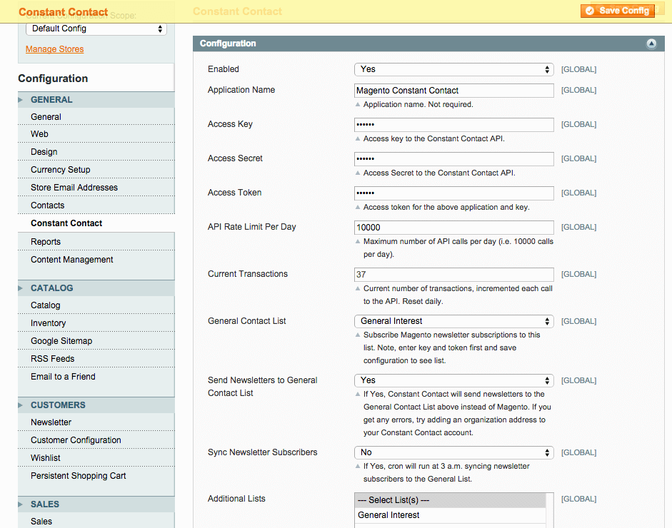

Constant Contact
===============
Add Magento users to Constant Contact contacts and lists.

Description
-----------
Add Magento users to Constant Contact contacts and lists. Users
can subscribe to lists by subscribing to the Magento newsletter. 
Additionally, by submitting a form on this page:

/constantcontact/form/subscribe

Installation Instructions
-------------------------

Upload this module's files to root of your 
Magento install. Let the setup script run. After the setup is completed, several new 
tables will be created:

<pre>
aydus_constantcontact_config
aydus_constantcontact_customer_list
aydus_constantcontact_subscriber_contact
</pre>

In the admin under System -> Configuration -> General -> Constant Contact,
configure the extension:

